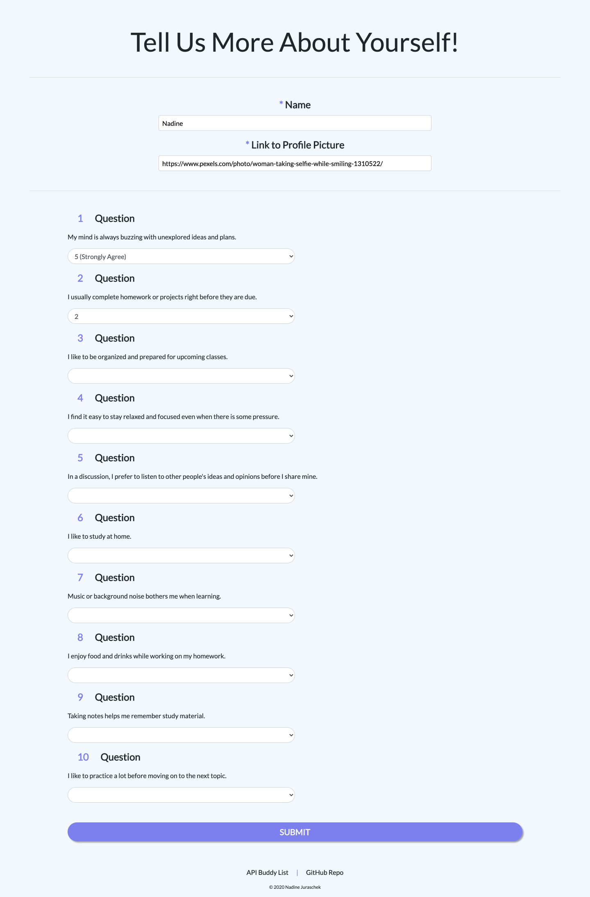
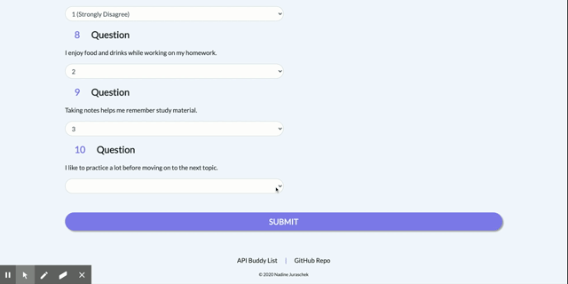
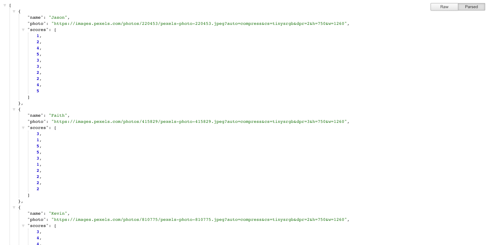
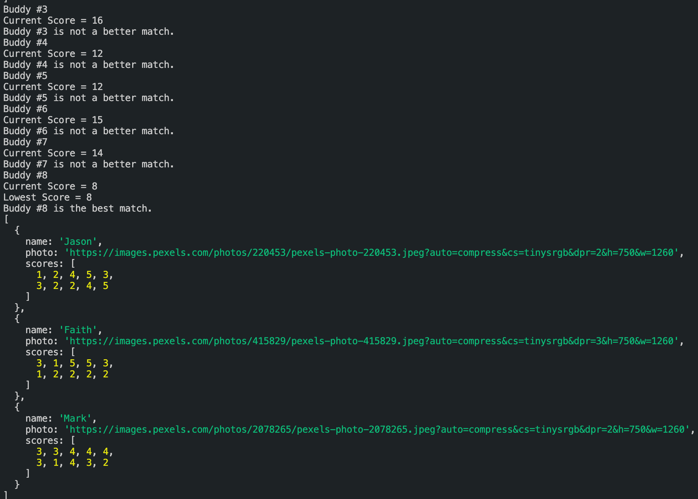

# Study Buddy

A compatibility-based "Study Buddy" Finder application. This responsive full-stack site takes in results from users' surveys and compares their answers with those from other users. The app will then display the names and pictures of the users with the best overall matches.

## How It Works
The user in search of a study buddy enters his or her name, a link to a profile picture, and answers a total of ten questions. The app then stores the given information and compares each answer score to all other users' scores in the Buddy API. It calculates the total difference between both score arrays and therefore finds the best Study Buddy Match(es) for the current user.

## Technologies
* JavaScript
* jQuery
* Node.js with
  * dotenv
  * express
  * body-parser
* Bootstrap

## Preview
### Landing Page


### Survey


### Best Matches Modal


### API


### Console


## How to Run the App Locally
1. clone the repository
```
git clone git@github.com:nadinejuraschek/StudyBuddy.git
```
2. install dependencies
```
npm i
```
3. create a .env file
* add a file called ".env" in the repositories folder
* choose a PORT for the app to run on
* in the .env file, add
```
PORT={your port number here}
```
4. start the app
```
npm start
```